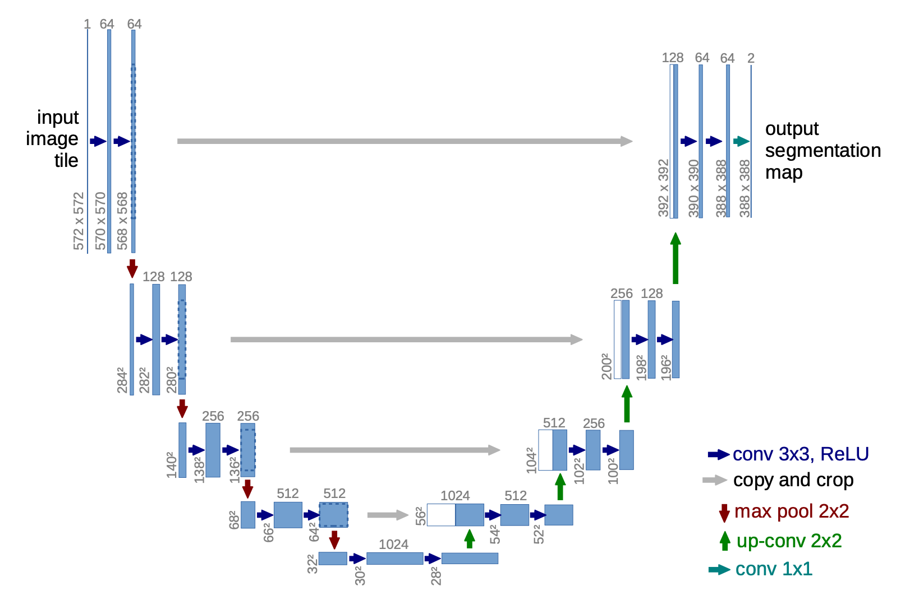

 DDPM: Denoising Diffusion Probabilistic Models in PyTorch

A PyTorch implementation of Denoising Diffusion Probabilistic Models (DDPM) using a U-Net backbone, demonstrated on the CelebA face dataset.

## Table of Contents

- [Overview](#overview)
- [Features](#features)
- [Repository Structure](#repository-structure)
- [Prerequisites](#prerequisites)
- [Installation](#installation)
- [Training](#training)
- [Inference](#inference)
- [Notebooks](#notebooks)
- [Project Details](#project-details)
- [Acknowledgements](#acknowledgements)
- [License](#license)

## Overview

This repository provides a clean PyTorch implementation of the DDPM framework with:
- Sinusoidal time embeddings
- Residual U-Net architecture
- Optional self-attention layers

The model is trained on the CelebA dataset of face images and can generate new samples by reversing the diffusion process.

## Features

- **U-Net Architecture**: Multi-scale encoder-decoder with residual blocks.
- **Sinusoidal Embeddings**: Time-step embeddings as in the original DDPM paper.
- **Attention Modules**: Optional self-attention for richer representations.
- **Configurable**: Control hyperparameters through `Configs/config.yaml`.
- **Visualization**: Real-time loss logging with TensorBoard and sample display.

## U-Net Architecture

Reference diagram of the U-Net backbone used in this project:



## Repository Structure

```
ddpm/
├── Models/                 # Model checkpoints & TensorBoard logs
├── Data/                   # Datasets (CelebA download)
├── Configs/                # YAML configuration files
├── Modules/                # Custom modules (embeddings, etc.)
├── diffusion/              # DDPM scheduler implementation
├── models.py               # U-Net, ResBlock, embeddings, attention
├── attention.py            # Multi-head self-attention layer
├── train.py                # Training script
├── inference.py            # Sampling/inference script
├── inference.ipynb         # Notebook for step-by-step inference
├── modules.ipynb           # Notebook exploring module components
├── play.ipynb              # Experimental playground notebook
├── pyproject.toml          # Project metadata & dependencies
├── uv.lock                 # Locked dependencies (uv tool)
├── .gitignore
└── README.md               # This file
```

## Prerequisites

- Python 3.10 or higher
- CUDA-enabled GPU (recommended)
- PyTorch >= 2.0.0 with matching CUDA toolkit
- torchvision, torchaudio
- Other dependencies listed in `pyproject.toml`

## Installation

1. Create and activate a Python 3.10 virtual environment with `uv`:
   ```bash
   uv venv python3.10
   source .venv/bin/activate
   uv sync
   ```

## Training

Configure training parameters in `Configs/config.yaml`, then run:
```bash
python train.py --config Configs/config.yaml
```
- **Batch size**, **learning rate**, **number of epochs**, **EMA decay**, etc. are all controlled in the YAML.
- Model checkpoints are saved under `Models/checkpoints/`.
- Training logs are written to `Models/tensorboard/` (viewable via `tensorboard --logdir Models/tensorboard`).
## Outputs

Here is an example animation of diffusion sampling (epoch 100):

<video controls loop autoplay muted width="400">
  <source src="outputs/e_100_3_3.mp4" type="video/mp4" />
  Your browser does not support the video tag.
</video>


## Notebooks

- **inference.ipynb**: Interactive walkthrough of the sampling process.
- **modules.ipynb**: Inspect and visualize individual components (embeddings, ResBlock, attention).
- **play.ipynb**: Scratchpad for experimenting with training loops, model tweaks, and sampling strategies.

## Project Details

- **models.py**: Defines `UNET`, `ResBlock`, `SinusoidalEmbeddings`, and integrates `Attention` from `attention.py`.
- **diffusion/sampler.py**: Implements the beta schedule and forward/backward diffusion equations.
- **attention.py**: Multi-head self-attention layer for image features.
- **Modules/**: Alternate module implementations and utilities.
- **Configs/config.yaml**: Default hyperparameters for training.
- **Data/**: Downloaded CelebA images (handled automatically by `torchvision.datasets.CelebA`).

## Acknowledgements

- **Denoising Diffusion Probabilistic Models** by Ho et al.
- Inspired by various PyTorch DDPM tutorials and the StyleTTS2 project structure.
